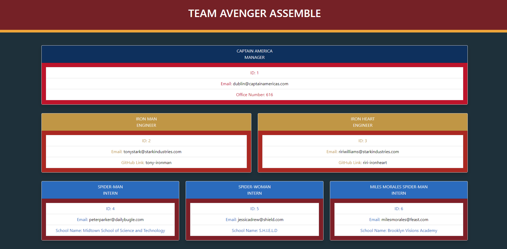

# Team File Generator
  
  
## Description 
  
This project utilized object-oriented programming to generate a team profile. Before the team is build, test is run in terminal with jest to ensure correct data entries. After the test is ran, users with input node index.js to terminal at which node will prompt users for information on manager, engineer, and intern. Users can customize and add on each type of employees to their team as they desired. Finally, once users are satisfied with their choices, node will generate an index.html with all the information displayed.


## Table of Contents

* [Installation](#Installation)
* [Usage](#Usage) 
* [Contributing](#Contributing)
* [License](#License)
* [Questions](#Questions)
  

## Installation 
  
Please run the following command to install required software:

```
npm init -y  
npm install jest
npm install inquirer 
to run test: npm run test 
to run node for prompt and generate html: node index.js
```


## Usage

These are the technologies and languages use for this project: 
* Node.js
* Objective-oriented programming
* Html
* Css
* Javascript 

Deployed GitHub Link:   This project does not have a deployable link. Please check [Installation](#Installation) section for detail 

Github Repository Link: https://github.com/vinhkhamhuynh/team-file-generator

[Click for video on Youtube DEMO Team File Generator](https://youtu.be/wJgaTZqeAwU)
  

  
   
## License 
  


 
This project is licensed under the MIT license. For more information, click here: https://spdx.org/licenses/MIT.html 
 


## Questions
  
Please follow me on Github for more projects: [vinhkhamhuynh](https://github.com/vinhkhamhuynh) 

For any questions or to report issues, please email me at: vinhkhamhuynh@gmail.com
  

